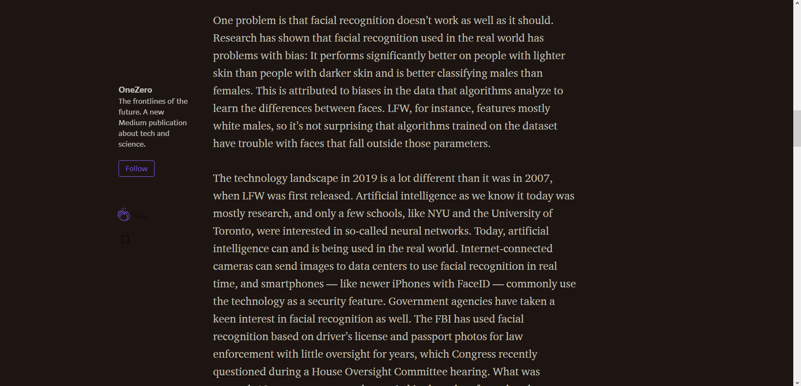

# DarkSite
## UserScripts to turn the web to the dark side
Darkmode/Nightmode for every website  
  

  
__________
  
Version 0.1 was kept as simple & monochrome DarkReader.  
[View and Install from greasyfork.org](https://greasyfork.org/en/scripts/388370-darkreader)  
Here are some screenshots of the DarkReader (v-1-0):  

__________
# Explanations // Erläuterungen

## [EN] What are user scripts?
User scripts put you in control of your browsing experience. Once installed, they automatically make the sites you visit better by adding features, making them easier to use, or taking out the annoying bits. The user scripts on Greasy Fork were written by other users and posted to share with the world. They're free to install and easy to use.  
[greasyfork.org](https://greasyfork.org/en)

## [DE] Was sind Benutzerskripte?
Benutzerskripte erlauben die vollständige Kontrolle des Interneterlebnisses. Einmal installiert werten sie automatisch die besuchten Seiten auf, indem sie diesen Funktionen hinzufügen, deren Verwendung vereinfachen oder störende Kleinigkeiten entfernen. Die Benutzerskripte auf Greasy Fork wurden von anderen Benutzern geschrieben und veröffentlicht um sie mit der ganzen Welt zu teilen. Sie sind frei verwendbar und einfach zu benutzen.  
[greasyfork.org](https://greasyfork.org/de)

__________

## [EN] About Tampermonkey
Tampermonkey is the most popular userscript manager, with over 10 million users. It's available for Chrome, Microsoft Edge, Safari, Opera Next, and Firefox.  
[www.tampermonkey.net](https://www.tampermonkey.net/?locale=en)

## [DE] Über Tampermonkey
Tampermonkey ist eine kostenlose Browser-Erweiterung und der beliebteste Userscript-Manager mit über 10 Millionen Nutzern. Die Erweiterung ist verfügbar für Chrome, Microsoft Edge, Safari, Opera Next, und Firefox.  
[www.tampermonkey.net](https://www.tampermonkey.net/?locale=de)